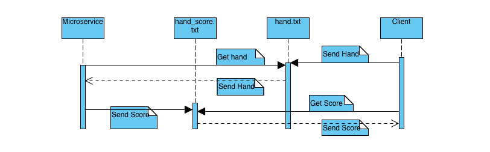

# Black_Jack_Microservice

This Microservice reads a black jack hand from hand.txt and returns the score of the hand in hand_score.txt

An exmple hand sent from the client into hand.txt would be A,2,4
The microservice will read that hand and calulate the score, in this case 17, and write it to hand_score.txt to be read by the client. 

# UML Sequence Diagram

